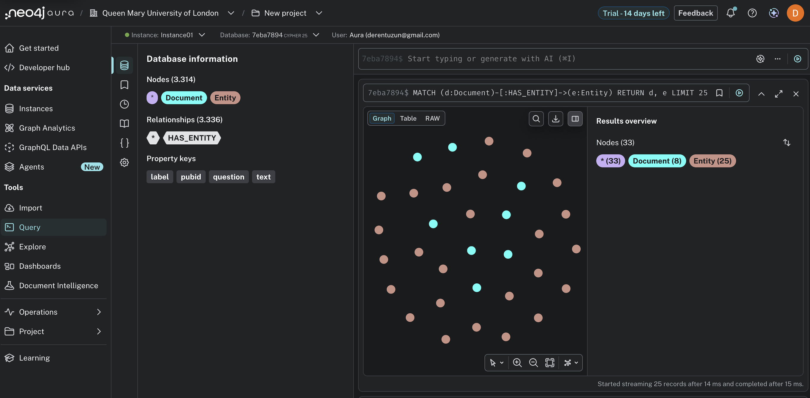

# MedGraphRAG 🧬

Biomedical Question Answering using Knowledge Graphs and GraphRAG

## Overview

This project builds a GraphRAG (Graph Retrieval-Augmented Generation) pipeline for biomedical question answering, combining Knowledge Graphs with LLM-based retrieval to improve reasoning over structured medical data.

Motivated by the limitations of keyword-based retrieval (explored in a prior BM25-based biomedical search engine project), this system leverages semantic relationships between biomedical entities to enhance answer quality.

## Architecture

```
PubMedQA Dataset → Entity Extraction (spaCy) → Knowledge Graph (Neo4j)
                                                        ↓
User Query → RAG Pipeline (LlamaIndex + ChromaDB) → GraphRAG → Answer
```

## Features

- **Dataset**: 1,000 labeled PubMedQA question-answer pairs
- **Entity Extraction**: Biomedical NER using spaCy
- **Knowledge Graph**: Neo4j graph database with entity relationships
- **RAG Pipeline**: ChromaDB vector store + LlamaIndex
- **Evaluation**: Vanilla RAG vs GraphRAG comparison

## Project Structure

```
medgraphrag/
├── assets/
│   └── kg_graph.png               # Knowledge Graph visualization
├── data/
│   ├── pubmedqa.json              # Raw dataset (1,000 records)
│   ├── pubmedqa_entities.json     # Dataset with extracted entities
│   └── chroma_db/                 # ChromaDB vector store
├── notebooks/
│   ├── 01_knowledge_graph.ipynb  # Data loading, NER, KG construction
│   └── 02_rag_pipeline.ipynb     # RAG pipeline, GraphRAG, evaluation
├── src/
│   └── __init__.py
├── .env.example
├── requirements.txt
└── README.md
```

## Knowledge Graph Preview



*3,314 nodes (Document + Entity) and 3,336 HAS_ENTITY relationships visualized in Neo4j Aura*

## Results

Evaluation on 3 biomedical questions from PubMedQA:

| Question | Expected | Vanilla RAG | GraphRAG |
|----------|----------|-------------|----------|
| Do mitochondria play a role in programmed cell death? | yes | ✅ Yes, critical and early role in PCD | ✅ Yes, with KG entity context (MitoTracker, TUNEL, PTP) |
| Is cell death in mesial temporal sclerosis apoptotic? | maybe | ✅ Data suggest apoptosis may not be involved | ✅ Cell death appears non-apoptotic despite caspase activation |
| Does aerobic exercise improve cognitive function in older adults? | yes | ⚠️ No direct info in dataset | ⚠️ No direct info in dataset |

**Key finding:** GraphRAG enriches answers with structured entity relationships from the Knowledge Graph, providing better source attribution and context compared to Vanilla RAG. Both approaches are limited by dataset coverage.

## How to Run

### 1. Clone the repository

```bash
git clone https://github.com/derentuzun/medgraphrag.git
cd medgraphrag
```

### 2. Set up environment

```bash
python -m venv venv
source venv/bin/activate  # On Windows: venv\Scripts\activate
pip install -r requirements.txt
```

### 3. Configure environment variables

Create a `.env` file in the project root:

```
NEO4J_URI=neo4j+s://your-instance.databases.neo4j.io
NEO4J_USERNAME=neo4j
NEO4J_PASSWORD=your-password
NEO4J_DATABASE=neo4j
HUGGINGFACE_TOKEN=hf_your_token_here
```

- **Neo4j**: Create a free instance at [console.neo4j.io](https://console.neo4j.io)
- **HuggingFace**: Get a free token at [huggingface.co/settings/tokens](https://huggingface.co/settings/tokens)

### 4. Run the notebooks

Open and run in order:

```
notebooks/01_knowledge_graph.ipynb   # Builds the Knowledge Graph
notebooks/02_rag_pipeline.ipynb      # Runs RAG, GraphRAG, and evaluation
```

## Status

- [x] Data loading and exploration
- [x] Entity extraction pipeline
- [x] Knowledge Graph construction (Neo4j)
- [x] RAG pipeline (LlamaIndex + ChromaDB)
- [x] GraphRAG integration
- [x] Evaluation and comparison

## Tech Stack

Python • spaCy • LlamaIndex • ChromaDB • Neo4j • HuggingFace • PyTorch

## Dataset

[PubMedQA](https://huggingface.co/datasets/qiaojin/PubMedQA) — 1,000 labeled biomedical question-answer pairs from PubMed abstracts.

## Disclaimer

This project is for research and educational purposes only. It is not intended for clinical decision-making or medical diagnosis. Always consult a qualified healthcare professional for medical advice.
